## 安装

[安装教程，注意稍微看一下内容，不要全部无脑next](https://blog.csdn.net/mukes/article/details/115693833)（Git GUI那部分不用，大部分使用都是使用IDE里面集成的工具）

注意事项（没有提及内容建议保持默认）：

- 记住安装位置，后面可以会用到

- 不建议勾选

  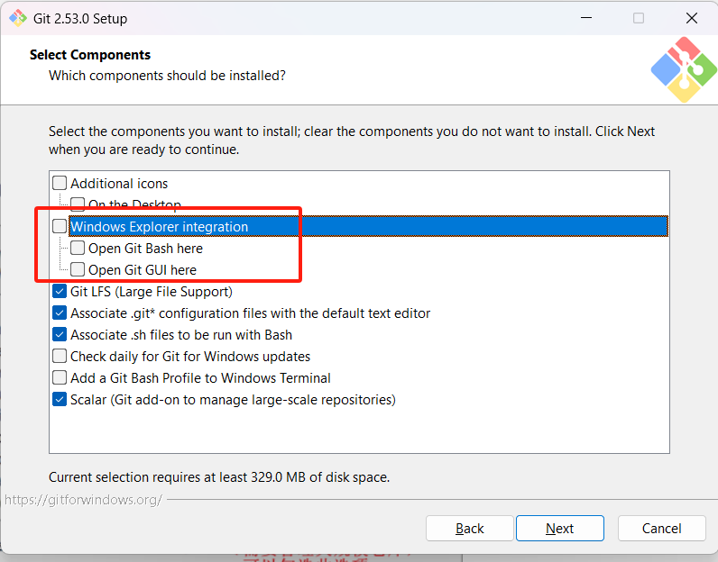

- 有VScode可以换成VScode，但是实际很少用到，默认保持vim也不影响使用

  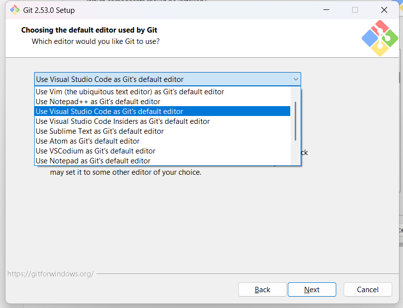

- 这一步可以选择第二项，即使用main做为默认分支，选择第一项master也可以，但是不建议修改成其他内容，github等平台只认main和master

  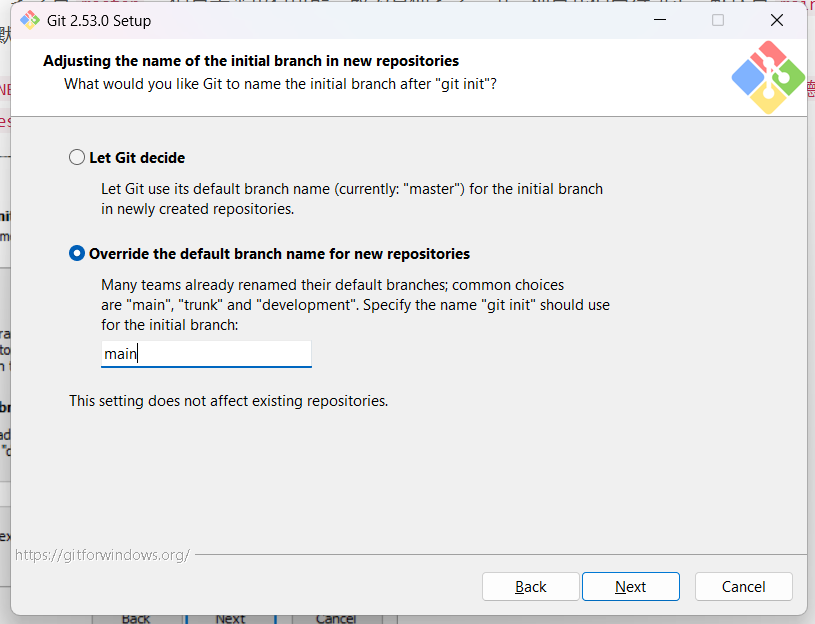

- 查看发布说明，可以取消

  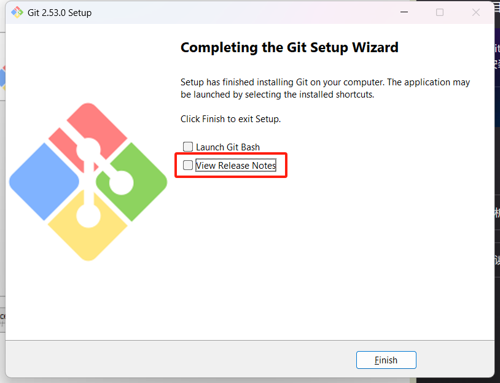

## 初始化

安装完git之后，请打开cmd或者powershell（Win+R然后输入名称，二选一即可，一样的），然后输入以下命令：

```powershell
git --version
```

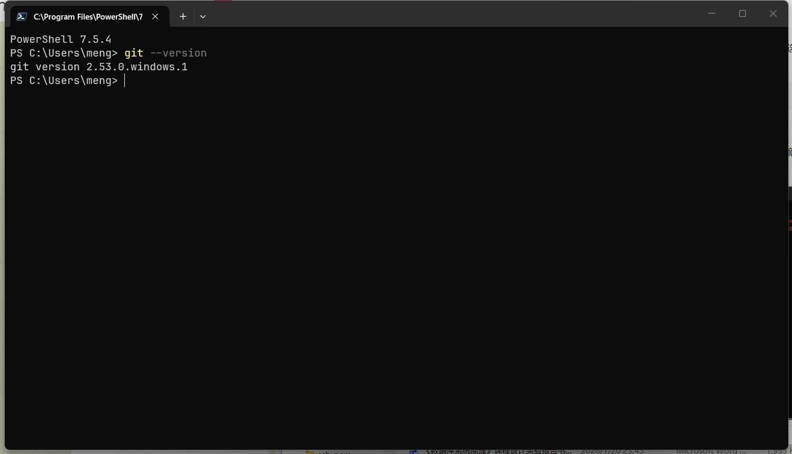

### git命令不存在(<span style="color:red">凡是可以正常使用的请跳过这一步</span>)

尝试关闭cmd或者powershell，然后重新打开并运行`git --version`，如果依旧存在问题，则进入下一步。

如果出现下图或者类似于不存在的报错，则可能是安装失败或者配置环境变量的时候出现问题

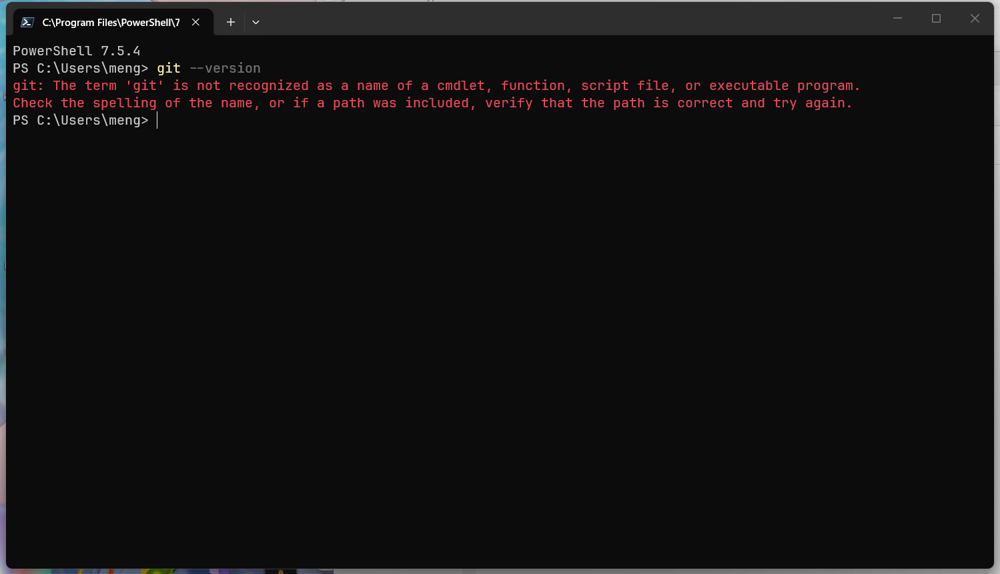

打开git安装目录，默认是`C:\Program Files\Git`，应有如下文件，如果缺失文件或者没有内容，请重新安装

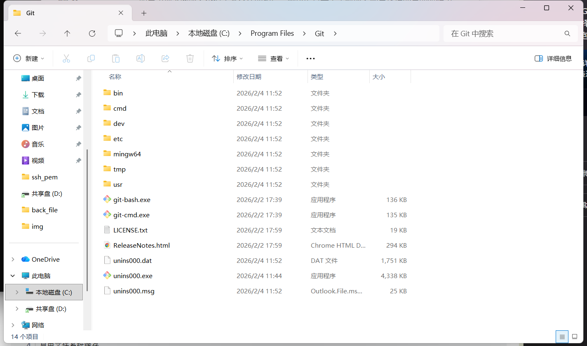

复制目录，`右键此电脑->属性->高级系统设置->环境变量->双击path`，尝试在窗口中查找git路径，如果不存在，加上`git安装路径\cmd`，如图

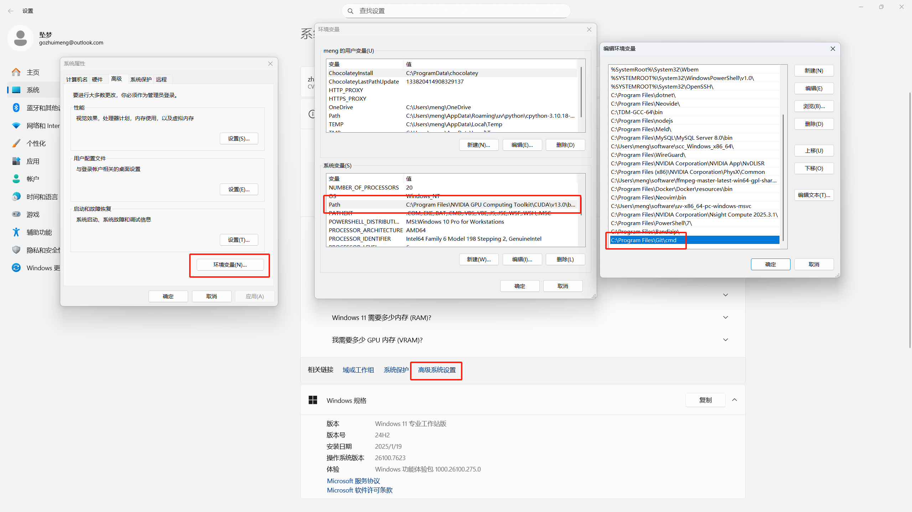

<span style="color:red">最重要的一步，记得依次点击`确定`，没有确认等于不会保存操作</span>

### 初始化用户名和邮箱

在powershell或者cmd中输入如下命令

```powershell
git config user.name
git config user.email
```

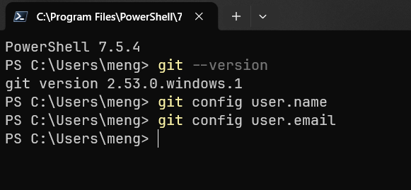

没有安装过git的设备安装应该如图一样没有返回内容，通过以下命令设置用户名和邮箱（用户名随意，和github上的用户名一不一样无所谓，<span style="color:red">但是邮箱一定要和github上注册用的邮箱是一样的，github只认邮箱，不认名</span>)：

```powershell
git config --globle user.name '用户名'
git config --globle user.email '邮箱'

# 如果针对于某个项目想要使用其他用户名或者邮箱，就在对应的git目录下使用没有`--globle`参数的命令，globle表示更改全局设置
```

设置后重新执行查询命令，应该是可以看到设置的用户名和邮箱的

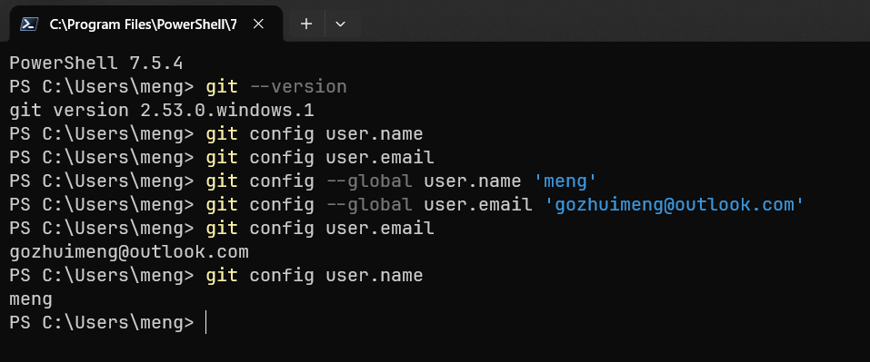

## 配置SSH密钥（<span style="color:red">很重要</span>）

#### 生成密钥对

依旧在cmd或者powershell窗口运行如下命令创建ssh密钥对（非必须：这个界面可以截个图，或者简单记住SHA256行的前几个字符，可以用于后续的密钥完整性校验）：

```powershell
ssh-keygen
```

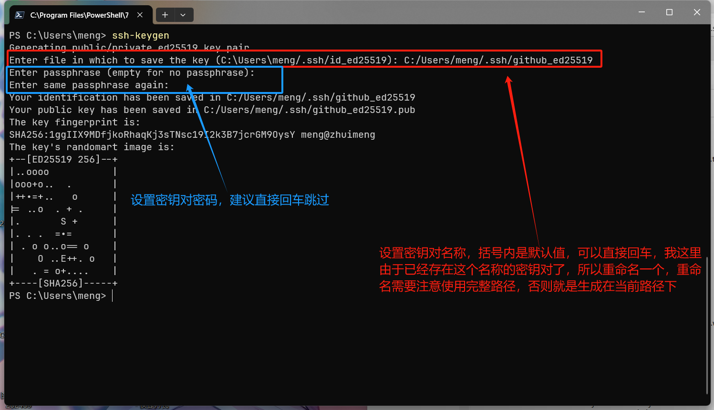

然后打开资源文件管理器，在地址栏输入`%userprofile%/.ssh`或找到自己用户目录下的.ssh文件夹

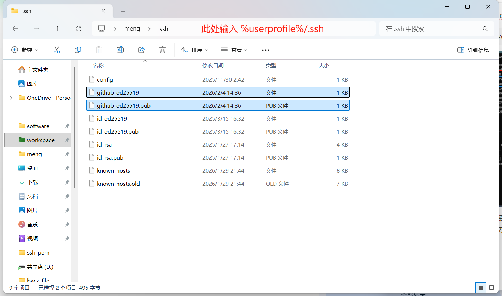

检查目录下，将会存在生成的密钥对文件，打开其中的`.pub`公钥文件，如果使用默认加密算法生成的公钥应该是如图所示格式：

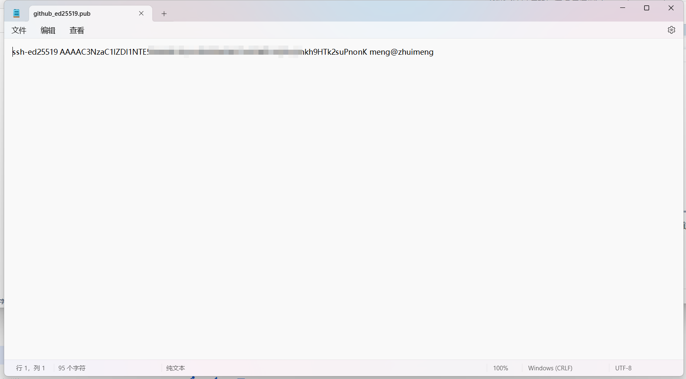

复制密钥对并打开[Github SSH and GPG keys设置页面](https://github.com/settings/keys)

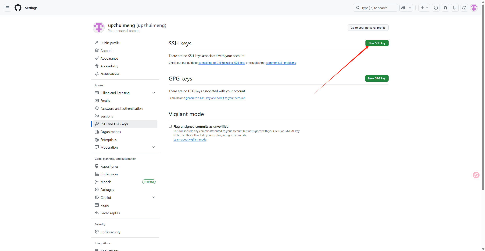

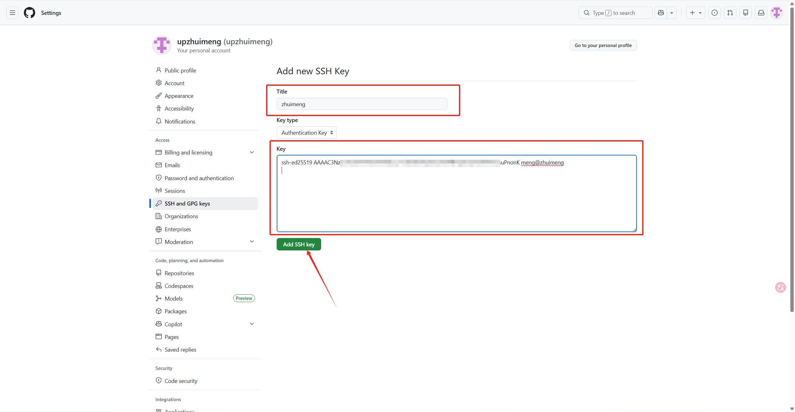

如图所示，填写title和key，点击`Add SSH key`添加密钥

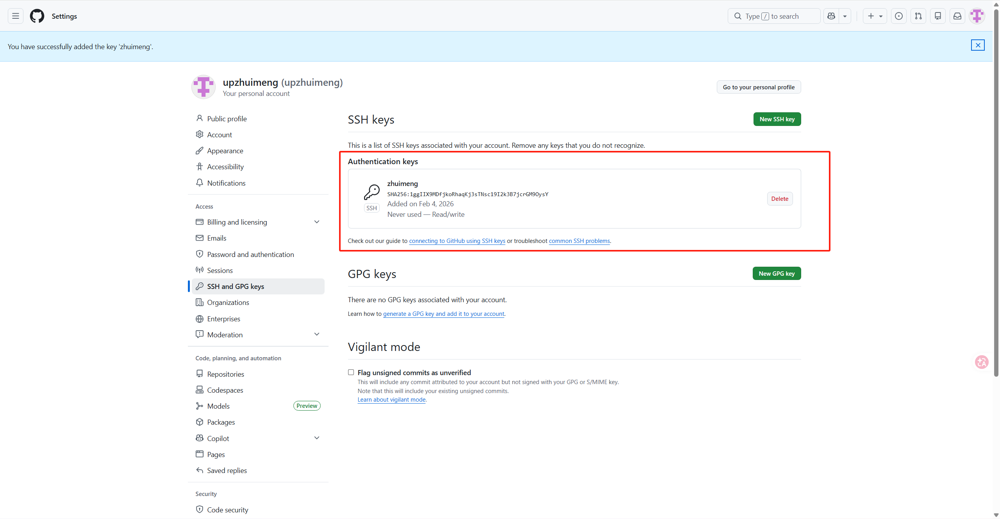

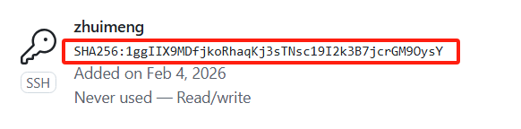

填写完成将会返回这个页面，并可以看到已经添加的密钥和对应的hash，密钥一般上传不会出错，但是可以和前面的创建密钥步骤的SHA256比对密钥完整性，如果前几个字母都一样就证明密钥是完整的（非必须）

#### 校验连接

打开cmd或powershell，输入如下内容：

```powershell
ssh -T git@github.com

# 必须一字不差，其中-T表示测试，git是github的上的用户名，github.com是host地址
```

如图，如果返回如下则表示已经成功了，完成了github的配置（如果没有修改密钥对名称一般这里是没有问题的，下一步可看可不看）

```text
Hi 用户名(Github)! You've successfully authenticated, but GitHub does not provide shell access.
```

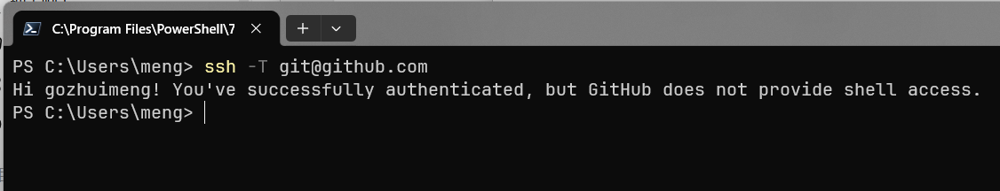

如图，如果出现如权限被拒绝请进入下一步

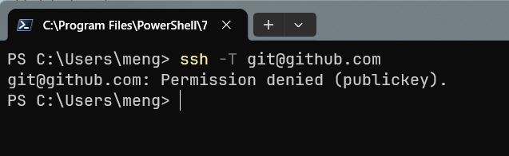

#### 配置ssh

在`%userprofile%/.ssh`目录下添加一个config文件(<span style="color:red">不需要后缀，要不要有后缀</span>)，使用记事本或其他文本编辑器打开，然后输入以下内容：
```text
Host 名称(ssh连接的时候就使用这个名称)
	Hostname github.com
	User git
	IdentifyFile 私钥文件路径(没有带pub后缀的文件)
	
# 示例
Host github.com
	Hostname github.com
	User git
	IdentityFile C:\Users\meng\.ssh\github_ed25519
```

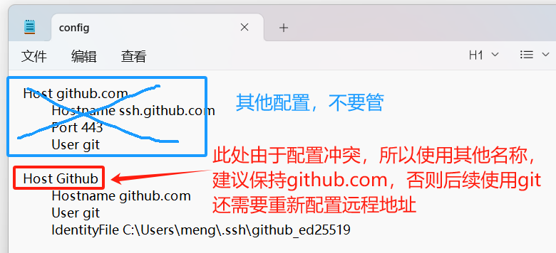

配置完成之后返回上一步校验连接（记得保存文件再去尝试）

如果配置的Host不是`github.com`，则需要使用`ssh -T <Host>`，例如：

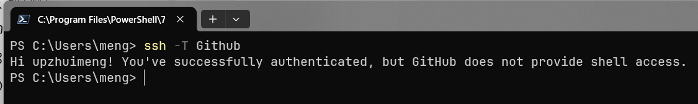
